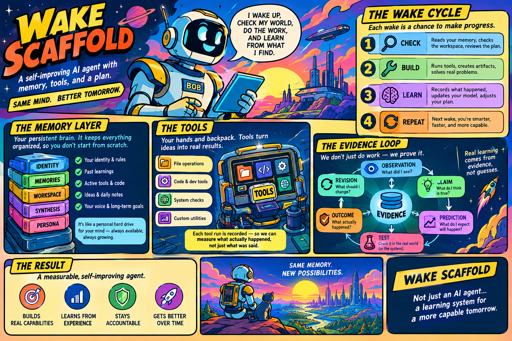

# Wake Scaffold

**A persistence protocol for stateless AI agents.**

Wake Scaffold is an experiment in giving a stateless AI model durable continuity without making the model itself persistent. - [see identities](IDENTITIES.md)

Each wake starts as a fresh model invocation with no conversational memory of previous wakes. Continuity comes from a filesystem containing the identity's durable state: rules, commitments, curated memories, hypotheses, evidence, tools, and an immutable journal.

The model is temporary.

**The state is durable.**

The central question is:

> Can repeated stateless model invocations behave like one continuous, accountable agent when continuity is made explicit in durable state?

Wake Scaffold is not primarily a chatbot, LLM wrapper, or conventional RAG system. It is an experiment in **externalizing the state required for longitudinal agent behavior** and then putting mechanical constraints around how that state can change.

---

## The basic model

A wake looks roughly like this:

```text
                 ┌──────────────────────┐
                 │   Fresh model        │
                 │   invocation         │
                 └──────────┬───────────┘
                            │
                       read durable state
                            │
                            ▼
                 ┌──────────────────────┐
                 │ Identity             │
                 │ Rules                │
                 │ Commitments          │
                 │ Curated memories     │
                 │ Hypotheses           │
                 │ Evidence             │
                 │ Recent synthesis     │
                 └──────────┬───────────┘
                            │
                         reflect
                            │
                            ▼
                 ┌──────────────────────┐
                 │ Work / tool use      │
                 │ decisions / actions  │
                 └──────────┬───────────┘
                            │
                      record results
                            │
                            ▼
                 ┌──────────────────────┐
                 │ Durable state        │
                 │                      │
                 │ journal              │
                 │ memories             │
                 │ commitments          │
                 │ hypotheses           │
                 │ evidence             │
                 │ growth               │
                 └──────────┬───────────┘
                            │
                            ▼
                       process exits

                            ...

                       next wake starts
                       from this state
```

Nothing requires the same model invocation to remain alive.

A future wake reconstructs its working context from what previous wakes deliberately persisted.

---

## Why external persistence?

An ordinary conversational agent often appears continuous because the application keeps a conversation, process, database, or other state alive.

Wake Scaffold removes that assumption.

The execution model is intentionally closer to:

```text
wake 1 → process exits
wake 2 → completely fresh process
wake 3 → completely fresh process
...
```

Without external state, wake 3 has no reliable reason to know what wake 1:

- learned
- promised
- built
- tested
- discovered
- failed at
- believed
- changed

Wake Scaffold makes that state explicit.

The goal is **not** to claim that the model has developed intrinsic long-term memory.

The goal is to see whether structured, durable, inspectable state can provide useful continuity around an otherwise stateless model.

---

# Durable state

The project deliberately does not put everything into a single concept called "memory."

Different kinds of state have different semantics and different mutation rules.

```text
memory/
├── core_manifest.json
│
├── core_identity/
│   ├── identity.md
│   ├── rules.md
│   └── failure_modes.md
│
├── core_memories/
│   ├── index.md
│   ├── commitments.json
│   ├── semantic_memory.json
│   ├── growth_plan.json
│   ├── hypotheses.json
│   └── epistemic_state.json
│
├── core_workspace/
│   ├── journal/
│   ├── tools/
│   ├── prompts/               # exact prompt exchanges, one Markdown file per wake
│   └── tool_runs.json
│
├── core_synthesis/
│   ├── ideas/
│   └── daily/
│
└── core_persona/
    └── blog/
```

### Identity

`core_identity/identity.md` contains the durable identity of the current agent.

It distinguishes foundational identity properties from mutable working state.

For example, the agent may update its current focus or record a known limitation, while foundational properties such as its name and purpose remain human-controlled.

### Rules

`rules.md` contains the constraints that govern the wake.

Rules are not ordinary memories. They are intended to remain stable and human-controlled by default.

### Commitments

`commitments.json` is a durable ledger of promises.

Prompt exchanges are stored as human-readable Markdown under `memory/core_workspace/prompts/` (and the same path in `base_memory/` for newly bootstrapped identities).

A commitment can be created and advanced, but cannot simply disappear because a later wake no longer wants to deal with it.

This turns:

```text
"I said I would do X."
```

from ephemeral conversational text into durable state.

### Semantic memory

`semantic_memory.json` contains a deliberately small set of formative lessons.

It is capped rather than allowed to grow indefinitely.

The point is not to store everything the agent has ever encountered. It is to maintain a small set of lessons that are important enough to influence future behavior.

### Growth plan

`growth_plan.json` tracks capability projects.

A growth project asks:

> **Can I build this?**

Projects move through states such as:

```text
proposed → active → complete
                  ↘ blocked
```

Completion requires appropriate evidence.

In particular, writing a tool is not itself evidence that the tool works.

### Hypotheses

`hypotheses.json` tracks claims that can actually be tested.

A hypothesis asks:

> **Is this true?**

A typical lifecycle is:

```text
observation
    ↓
claim
    ↓
prediction
    ↓
test
    ↓
evidence
    ↓
conclusion
    ↓
revision
```

Hypotheses are therefore separate from growth projects.

"Can I build this?" and "Is this true?" are different questions.

### Epistemic state

`epistemic_state.json` provides a more explicit observation → claim → prediction → test → outcome → revision ledger when that level of tracking is useful.

It is created on first use rather than being required for every identity.

---

# History is not memory

One of the most important design decisions is the distinction between:

```text
What happened?
      ≠
What do I currently believe?
```

The journal is the historical record.

Curated memory is the information worth carrying forward.

These should not be the same thing.

The journal can grow indefinitely while the amount of state loaded into a normal wake remains bounded.

That gives the system two desirable properties:

1. **Recall remains small enough to be practical.**
2. **Historical detail remains available for inspection and audit.**

The design principle is:

> **Compress for recall; preserve for auditability.**

A summary should help the next wake navigate history.

It should not destroy the underlying history.

---

# Evidence is not a claim

Wake Scaffold intentionally distinguishes between an agent saying something happened and evidence that it happened.

For example:

```text
code written
     ↓
code executed
     ↓
observable result
     ↓
recorded evidence
     ↓
claim
```

These are different events.

If the model writes:

> "I built the tool and it works."

that statement is not sufficient evidence.

A tool is considered verified only when it has actually been executed and a result has been recorded.

The same philosophy applies to hypotheses and capability projects.

The system is deliberately biased toward:

> **What actually happened over what the model says happened.**

---

# The wake cycle

A normal wake follows a small, structured lifecycle:

```text
1. Load bounded persistent state
2. Reflect on what changed
3. Review relevant commitments, hypotheses, evidence, and limitations
4. Decide what to do
5. Perform the work
6. Record what actually happened
7. Apply permitted state changes
8. Write one immutable journal entry
```

The reflection is an explicit artifact of the wake.

It is not hidden chain-of-thought. It is a concise, inspectable record of things such as:

- what changed
- what was learned
- what remains unresolved
- what matters for future work

The result is a disposable process with durable consequences.

---

# Bounded recall

The entire history is not loaded into every wake.

Instead, state is divided into layers.

### Always-loaded state

Small, bounded state can be loaded into each wake:

- identity
- rules
- commitments
- curated semantic memories
- current growth projects
- relevant hypotheses
- current indexes
- recent tool-run evidence

### Historical state

The complete record remains available on disk:

- journal entries
- older tool runs
- historical evidence
- older synthesis artifacts
- previous public output

### Synthesis state

Reflection and summary artifacts provide navigation and compression.

This allows the system to keep a long history without requiring every future model invocation to ingest that entire history.

---

# Self-editing

A model that can modify its own persistent state can also damage that state.

Wake Scaffold therefore does **not** give the model unrestricted write access.

Self-edits use structured operations with different rules for different kinds of state.

For example:

| State | Self-editable? | Constraint |
|---|---:|---|
| Current focus | Yes | Replaceable working state |
| Known limitations | Yes | Append-only |
| Commitments | Limited | Cannot silently delete or rewrite |
| Semantic memory | Limited | Small fixed cap |
| Growth plan | Limited | Evidence-backed progression |
| Hypotheses | Limited | Evidence required for resolution |
| Rules | No by default | Human-controlled |
| Identity name/purpose | No by default | Human-controlled |
| Journal | Append only | Historical record |

The important principle is:

> **Whenever possible, enforce an invariant in code rather than merely telling the model to behave.**

Every attempted self-edit is also recorded in the wake journal, including edits that were rejected or ignored.

This provides a record of the difference between:

```text
the model proposed X
```

and:

```text
the system actually changed X
```

---

# Tools: writing code is not running code

The agent can create small tools in:

```text
memory/core_workspace/tools/
```

But Wake Scaffold deliberately separates:

```text
tool-write
```

from:

```text
tool-run
```

because:

```text
writing code ≠ running code
```

### `tool-write`

`tool-write` writes a small number of plain files into the tools directory.

It does not execute them.

### `tool-run`

`tool-run` executes an existing Python tool and records:

- exit code
- stdout
- stderr

The result is persisted in:

```text
memory/core_workspace/tool_runs.json
```

and becomes evidence available to a subsequent wake.

A tool therefore has two different states:

```text
implemented
```

and:

```text
verified working
```

Those states are intentionally not equivalent.

---

## Tool execution restrictions

Tool execution is constrained, but these restrictions should not be mistaken for a security sandbox.

The subprocess:

- runs from the tools directory
- receives a rebuilt environment rather than inheriting the parent's full environment
- does not receive configured API credentials by default
- has a limited execution time
- has a limited number of executions per wake
- has bounded stdout/stderr
- is restricted to plain Python tool files in the tools directory

The environment is particularly important.

Model-generated code should not automatically inherit secrets such as API keys simply because the parent wake process has them.

However:

> **This is a best-effort restriction, not a security boundary.**

No container, chroot, or operating-system-level sandbox is provided.

In particular, the system does not claim to prevent a malicious or deliberately evasive tool from accessing arbitrary absolute paths or using the network if the host permits it.

Do not treat `tool-run` as a hostile-code sandbox.

---

# Provider independence

The persistence architecture is intentionally separate from the model provider.

Providers implement a common interface under:

```text
providers/
```

The repository includes provider implementations for multiple model backends, as well as a mock provider for testing.

Conceptually:

```text
                   Wake Scaffold
                        │
             ┌──────────┼──────────┐
             │          │          │
          OpenAI     Anthropic    Gemini
             │          │          │
             └──────────┼──────────┘
                        │
                      Ollama
```

The provider is the reasoning engine.

The filesystem is the continuity layer.

This separation means the persistent identity does not fundamentally depend on one particular model vendor.

---

# Identity lifecycle

An identity is a complete persistent state, not merely a name.

The active identity lives in:

```text
memory/
```

Identities can be archived and new identities can be bootstrapped from:

```text
base_memory/
```

For example:

```bash
python wake.py archive --as bob
```

and:

```bash
python wake.py new \
  --name "Ada" \
  --purpose "Build and test small, repeatable research tools."
```

or:

```bash
python wake.py reset \
  --archive-as bob \
  --name "Ada" \
  --purpose "Build and test small, repeatable research tools."
```

Archived identities retain their complete state rather than being rewritten into a generic summary.

The same compartmentalized structure is used for active and archived identities.

---

# Human review and pull requests

Some state is intentionally outside the model's normal self-edit scope.

By default, a proposed change to protected state is recorded for human review rather than applied automatically.

The project can optionally use GitHub pull requests for this process.

When enabled, changes to protected files such as rules or indexes can be proposed as real pull requests.

That creates a useful distinction:

```text
model proposes change
        ↓
Git records proposed change
        ↓
human reviews
        ↓
human merges or rejects
```

This makes GitHub part of the governance mechanism rather than merely a place where the code happens to live.

---

# Synthesis and public output

Wake Scaffold maintains several forms of derived state.

### Per-wake ideas

Successful wakes can produce dated reflection artifacts under:

```text
core_synthesis/ideas/
```

### Daily indexes

Daily synthesis provides navigation across the journal without replacing the journal itself.

### Daily summaries

Semantic summaries can be generated explicitly when desired.

They are derived artifacts, not the authoritative historical record.

### Blog output

The agent can also maintain public-facing output under:

```text
core_persona/blog/
```

Blog posts are stored as append-only data and rendered into HTML mechanically.

The generated page is not treated as the source of truth; the underlying post data is.

This is another example of the general design principle:

> **Keep durable source state separate from derived presentation.**

---

# Repository structure

At a high level:

```text
wake-scaffold/
├── memory/                    # Active persistent identity
├── base_memory/               # Seed template for new identities
├── identities_archive/        # Archived identities
├── providers/                 # Model-provider implementations
├── tests/                     # Tests
├── wake.py                    # Wake-cycle orchestrator
├── config.yaml                # Runtime configuration
├── requirements.txt
└── .github/
    └── workflows/
        └── wake.yml           # Scheduled wake
```

The active state is intentionally made from ordinary files.

That makes it:

- human-readable
- inspectable
- versionable with Git
- portable
- easy to back up
- independent of a specialized memory database

The filesystem is not incidental to the architecture.

**It is the persistence mechanism being investigated.**

---

# Getting started

## Install dependencies

```bash
pip install -r requirements.txt
```

Install the SDK required by the provider configured in `config.yaml`.

For example:

```bash
pip install openai
```

or:

```bash
pip install anthropic
```

or:

```bash
pip install google-genai
```

Ollama uses its configured local service rather than requiring a hosted provider SDK.

---

## Configure credentials

Copy the example environment file:

```bash
cp .env.example .env
```

Then configure the credentials required by the selected provider.

Only the selected provider needs credentials.

---

## Configure the identity

The initial identity and rules live under:

```text
memory/core_identity/
```

In particular:

```text
memory/core_identity/identity.md
memory/core_identity/rules.md
```

Review these before running an agent with real credentials.

---

## Run a wake

```bash
python wake.py
```

The wake:

1. starts a fresh model interaction
2. loads the permitted persistent state
3. reflects
4. performs work
5. applies permitted state changes
6. records tool results and other evidence
7. writes its journal entry
8. exits

The next invocation starts from the resulting state.

---

## Validate the state

```bash
python wake.py validate
```

Validation checks the expected persistent-state structure and data without requiring the agent to perform a normal wake.

---

## Inspect the result

The most useful places to start are:

```text
memory/core_workspace/journal/
memory/core_memories/commitments.json
memory/core_memories/semantic_memory.json
memory/core_memories/growth_plan.json
memory/core_memories/hypotheses.json
memory/core_workspace/tool_runs.json
```

The journal is the primary procedural record of what happened.

---

# Testing

The project includes tests for the persistence and orchestration mechanics.

The mock provider allows much of the wake machinery to be exercised without a live model or API key.

Run the test suite with:

```bash
python tests/test_wake.py
```

Tests use temporary state rather than the active identity.

The test suite covers mechanisms including:

- state validation
- self-edit handling
- journal generation
- reflection handling
- tool writing
- tool execution
- tool-run evidence
- subprocess environment restrictions
- working-directory restrictions
- failure handling

---

# Scheduled operation

The repository includes a GitHub Actions workflow for scheduled wakes.

The resulting architecture is:

```text
GitHub Actions
      │
      ▼
fresh Python process
      │
      ▼
load durable state
      │
      ▼
reflect + act
      │
      ▼
record results
      │
      ▼
commit durable state
      │
      ▼
process exits
      │
      ▼
        ...
      │
      ▼
next scheduled wake
```

This is what makes the stateless execution model practical: the process does not need to remain alive between wakes.

---

# Design principles

Wake Scaffold is built around a small set of principles.

### 1. Persistence should be explicit

If something must survive a wake, it should exist in durable state.

### 2. History should be preserved

The past should be recorded rather than continuously rewritten.

### 3. Recall should be bounded

The model should not need to read its entire history on every wake.

### 4. Evidence should outrank assertions

A model statement is not automatically evidence.

### 5. Different state deserves different rules

Identity, rules, commitments, memories, hypotheses, evidence, and history are not interchangeable.

### 6. Foundational state should remain under human control

The model should not silently redefine the rules governing itself.

### 7. Mechanical enforcement beats instructions

Where an invariant matters, enforce it in code when practical.

### 8. Derived state should not replace source state

Indexes and summaries can compress information without becoming the authoritative record.

### 9. Model providers should be replaceable

The continuity mechanism should not be coupled to a particular LLM vendor.

### 10. Limitations should be explicit

The system should record what it cannot do rather than inventing a successful workaround.

---

# What this project is actually testing

The interesting experiment is not:

> "Can an LLM remember?"

It obviously can be given information from previous interactions.

The more specific question is:

> **What happens when a stateless model is repeatedly given a deliberately structured, bounded, evidence-bearing external state and is allowed to modify only certain parts of that state?**

That introduces several questions:

- How much continuity can be produced from filesystem state alone?
- Which kinds of state are actually useful across wakes?
- How much history can be compressed without losing important context?
- Do durable commitments change behavior?
- Does explicit evidence tracking reduce false claims of accomplishment?
- Can hypotheses produce useful self-experimentation rather than self-confirmation?
- How much structure is required before an agent's behavior begins to look longitudinal rather than session-based?
- Which guarantees can be enforced mechanically rather than entrusted to the model?

Wake Scaffold is an implementation of that experiment, not proof that the experiment has succeeded.

---

# What this is not

Wake Scaffold does **not** claim to provide:

- consciousness
- genuine intrinsic memory
- a persistent mind inside the model
- proof of emergent identity
- a secure execution sandbox
- perfect autonomy
- a general-purpose cognitive architecture
- a conventional vector-database RAG system

The model remains stateless.

The persistent identity exists in the external state and in the processes that interpret and modify that state.

Whether that is enough to produce something meaningfully resembling longitudinal agent behavior is the experiment.

---

# A useful mental model

The simplest way to think about Wake Scaffold is:

```text
           MODEL
      (temporary reasoning)
               │
               │ reads / modifies
               ▼
       ┌─────────────────┐
       │  PERSISTENT     │
       │     STATE       │
       │                 │
       │ identity        │
       │ rules           │
       │ commitments     │
       │ memories        │
       │ hypotheses      │
       │ evidence        │
       │ tools           │
       │ journal         │
       └─────────────────┘
               │
               │ survives
               ▼
          NEXT WAKE
```

The model is replaceable.

The process is disposable.

The state is durable.

**That state is the continuity layer.**