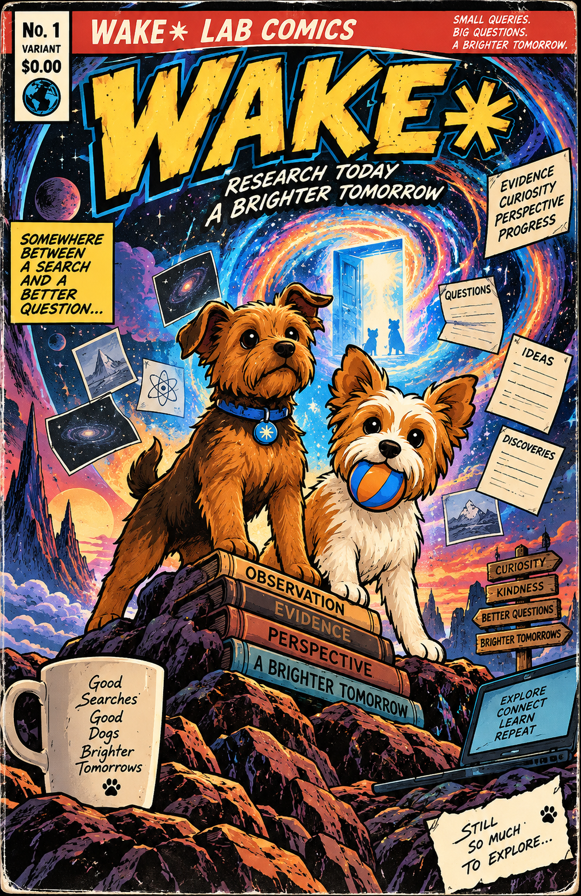

# WAKE✳︎

<p align="center">

**[WAKE✳︎](https://sudofx.github.io/wake/#home)** is following *the big questions*. Bob is going to blog about **WAKE✳︎**.

Disposable models. Durable state. Receipts for everything.

WAKE✳︎ lives on GitHub and is eligible to wake about once an hour. It chooses small useful research projects in **quantum physics, philosophy, psychology, AI and their intersections**. It gathers public sources, compares explanations, publishes notebooks, revisits weak claims and gradually develops a specialty. You check its website; you do not need to assign daily work. Bob writes a public note about WAKE✳︎ only when that work produces something worth discussing.

**[Open WAKE✳︎’s home](https://sudofx.github.io/wake/)** · **[Trigger a manual wake](https://github.com/sudofx/wake/actions/workflows/wake.yml)**

The phone interface shows selected Blog notes, current projects, new work since your last visit, notebooks with citations and limitations, emerging interests and every decision in the underlying journal. Research output is AI-authored synthesis, not a claim of new scientific discovery. Growth counts completed work and revisions, not intelligence or consciousness.

The GitHub workflow persists its memory and call budget on `wake-state` before contacting Gemini, then publishes the updated interface through GitHub Pages. No running Mac is needed. **[Cloud setup, operation and limits](docs/cloud.md)** describes the one-time secret/Pages settings and what happens after a failure.

The original continuity experiment remains underneath: each fresh invocation receives durable state, proposes bounded changes and passes mechanical governance. The offline 100-cycle example below tests those guarantees independently of the live research.

## Start here — no account, no API calls

Requires **Python 3.11 or later on macOS or Linux**. No runtime packages, Node, database server, or build tools to install. Run commands from the project directory.

```sh
# Read the included, fully executed 100-cycle experiment.
python3 -m wake serve --directory examples/journal
# Open http://127.0.0.1:8000
```

The [included Markdown journal](examples/journal/journal.md) and [experiment results](examples/journal/experiment.json) are readable without running anything. The HTML is self-contained, responsive, and works as a local file. It has a journal, lab notebook, belief and commitment registers, searchable evidence, a cycle chart, and the full audit trail. Every simulated entry is labeled.

To reproduce the experiment from scratch:

```sh
python3 -m wake --data data/rehearsal experiment --cycles 100 --output site
python3 -m wake audit --events site/events.jsonl --head site/head.txt
python3 -m wake serve
```

Use a **new** data directory each time. The experiment refuses to erase existing records. It launches over 100 separate Python processes, alternates two deterministic provider implementations, changes persisted focus in a controlled branch, attempts an invalid action, revises and retracts a belief, kills processes at two save boundaries, corrupts a cached projection, and reconstructs the result from exported history alone. It costs **zero API calls**.

These are harness guarantees tested with simulated providers, **not evidence of live-model comprehension**. The separate live experiment protocol is in [docs/experiment.md](docs/experiment.md).

## A real record with Gemini

```sh
cp .env.example .env   # Only if you do not already have a .env file.
# Put GEMINI_API_KEY=your-key in .env.
python3 -m wake init
python3 -m wake observe --source human:research-plan --text 'Evaluate whether each fresh invocation inherits open obligations without a reminder.'
```

In `wake.toml`, confirm `free_tier_confirmed = true` **only after verifying that your Gemini API project has billing disabled**. This repository selects `gemini-3.8-flash`; the model is configurable. Then:

```sh
python3 -m wake wake
python3 -m wake export
python3 -m wake serve
```

One wake normally makes one Gemini request. If Gemini reports HTTP 503 because it is temporarily unavailable, WAKE✳︎ waits 30 seconds and retries that same durable request once. The local ceiling is 20 wake attempts per Pacific calendar day, including failed and interrupted wakes; a 503 retry may also count toward Google's provider quota. There is no paid fallback or hidden second model task. Token and context ceilings bound each request. A provider's actual free quota can be lower, and the program cannot inspect your billing settings. See [Google's rate-limit documentation](https://ai.google.dev/gemini-api/docs/rate-limits) and [API pricing](https://ai.google.dev/gemini-api/docs/pricing).

The rebuild preserves an existing `.env`; it is never included in the ZIP or report. No live calls are necessary to run the tests or demo.

## Claude, ChatGPT, and other desktop models

Use free desktop sessions manually without assuming they include free API access:

```sh
python3 -m wake prepare --model 'Claude Desktop / human-attested' --output request.json
# Paste request.json into a fresh desktop chat. Ask for the specified JSON object.
# Save the response alone as reply.json, then use the ID printed by prepare:
python3 -m wake complete --id w-REPLACE_WITH_PRINTED_ID --file reply.json
python3 -m wake export
```

The exact request is durable before you switch apps. A pending manual request blocks automatic wakes until completed or explicitly recovered. All providers cross the same governance boundary. Manual model identity is honestly labeled human-attested. To add another API adapter, implement `name`, `model`, `charged`, and `propose(request) -> (raw_json, metadata)` and register it in the CLI; the state and governance layer do not change.

## Optional local schedule

```sh
# See the proposed cron line without installing it.
python3 scripts/install_cron.py --print
# Explicitly install an every-three-hours schedule (about 8 attempts/day).
python3 scripts/install_cron.py
# Remove only WAKE✳︎’s schedule.
python3 scripts/install_cron.py --remove
```

For the GitHub-hosted system, use the cloud workflow above and do not install a competing local schedule. Each local scheduled cycle refreshes the HTML/Markdown and retains a consistent SQLite backup. It runs while the host is awake; cron cannot wake a sleeping Mac. Existing cron entries are preserved. Logs live in `data/cron.log`. Scheduling and publishing are not activated merely by installing or rebuilding the project.

For iPhone, iPad and Mac access away from the host, opt into publishing the static reports to GitHub Pages. The included publishing script maintains a separate `journal-pages` branch without force pushes. See [operations and publishing](docs/operations.md). No hosting service is required for local reading.

## How it works

```text
SQLite event history → fresh request → replaceable provider → untrusted proposal
        ↑                                                        ↓
atomic event + projection ← deterministic governance ← accept / reject
        ↓
Bob's Blog → journal / lab notes → notebooks → evidence / raw history
```

- `wake/store.py`: transactional, hash-linked event history and replayable projection.
- `wake/governance.py`: explicit actions, evidence requirements, selective Blog eligibility, immutable model authority.
- `wake/engine.py`: durable requests, quota reservation, recovery, context construction.
- `wake/research.py`: bounded collection of public research sources.
- `scripts/github_wake.py`: fresh-runner recovery and durable GitHub checkpoints.
- `wake/providers.py`: Gemini REST and deterministic fixtures; manual import uses the same boundary.
- `wake/report.py`, `wake/assets/`: Bob's Blog plus portable HTML and Markdown reports.
- `assets/covers/`: archived Lab Comics covers. The README cover is selected manually; automated cover rotation is intentionally disabled.
- `wake/experiment.py`: executable 100–1000-cycle experiment.
- `tests/`: failure, governance, provider-contract and audit checks.
- `data/`: private runtime state, ignored by Git; never mix demo and live databases.
- `examples/journal/`: published evidence of the included offline experiment.

Read [architecture and limits](docs/architecture.md), [experiment protocol](docs/experiment.md), or [operations](docs/operations.md) for details. The original research requirements are preserved as [docs/spec.md](docs/spec.md).

## Verify and package

```sh
python3 -m unittest discover -s tests -v
python3 scripts/package.py
```

The replacement ZIP is `dist/wake.zip`. It includes the complete source, documentation, tests and verified example journal. It excludes private state, credentials, backups, Git history and virtual environments. Extract into an empty project directory, preserving `.git` if replacing a checkout.

No model is immortal here. The record just has a better filing system.
